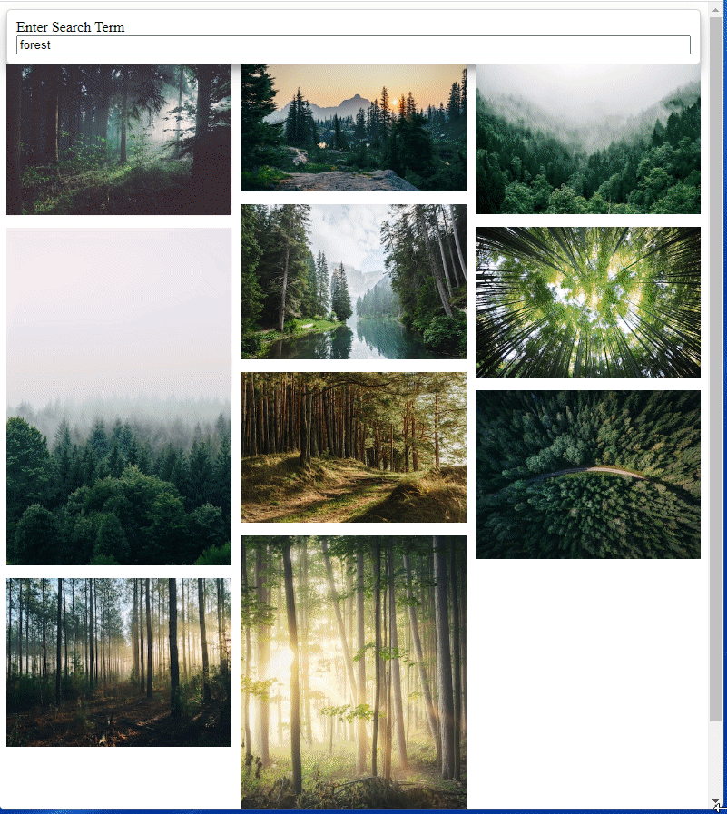

<h1 align="center">
    <a href="#"> React APP to search images </a>
</h1>

<h3 align="center">
    Simple project with React.js, Bulma, Axios
    to search images using UNSPLASH API
</h3>

<h4 align="center"> 
	 Status: Finished
</h4>


## Layout




## Running the web application

```bash

# In the project directory, you can run:

> npm install
> npm install bulma
> npm install axios
> npm start

```

---


## Author

Made by Serjus 👋🏽 

## License

This project is under the license [MIT](./LICENSE).

---
